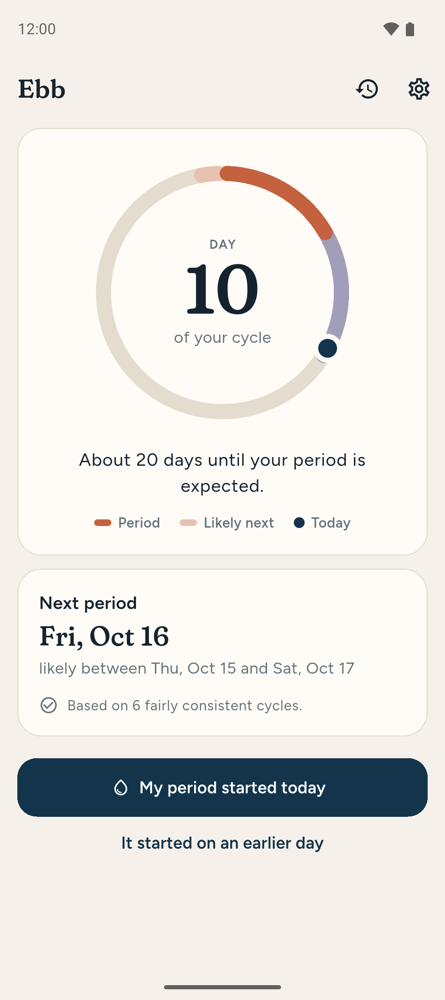
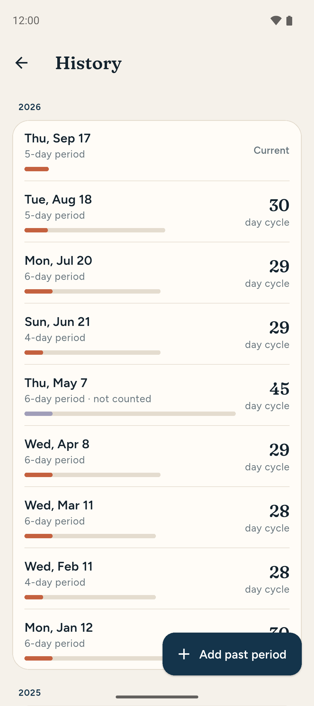
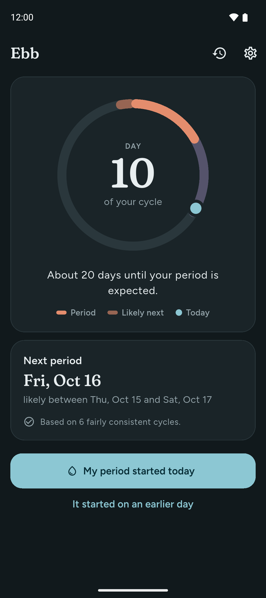
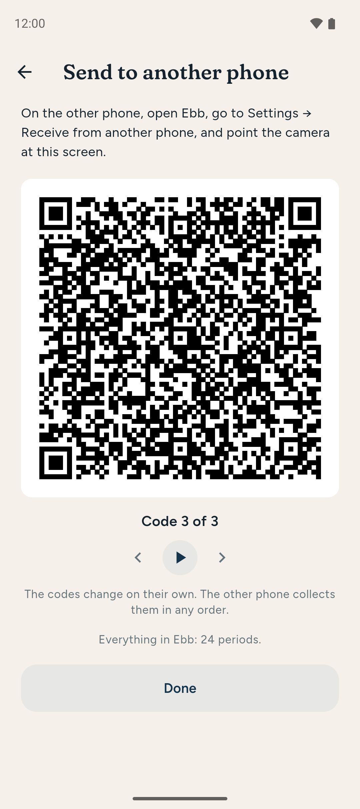

<div align="center">
  
  <h1>Ebb</h1>
  <p>A cycle tracker that keeps your data on your phone.</p>
</div>

Ebb records your menstrual cycle, predicts when your next period is likely, and
reminds you beforehand. It does all of that on your device.

<p align="center">
  
  
  
  
</p>
<p align="center"><sub>Screenshots use fictional data.</sub></p>

## Your data stays on your phone

The question "what do they do with my data?" has a boring answer here: nothing,
because we never receive it.

- **No account, no server, no sync.** Everything you log is written to a SQLite
  database on your device. It only goes anywhere else if you move it yourself —
  a backup file, or another phone.
- **No network access at all.** Release builds of Ebb ship without Android's
  `INTERNET` permission. The app is not *promising* to keep your data local —
  Android makes it impossible for it to do anything else, and you can verify
  that yourself in the app's permission list, which is short: notifications
  (reminders), camera (only while receiving from another phone; nothing is
  recorded or kept), and restarting reminders after a reboot.
- **Nothing to sell.** No analytics, no advertising, no third-party SDKs. There
  is no copy of your data for anyone to buy, subpoena, or leak, including us.
- **Excluded from cloud backup.** Ebb opts out of Android's automatic backup so
  your history isn't silently copied to a cloud drive.
- **Erasable instantly.** Delete your data in Settings, or uninstall the app.
  Ebb keeps no other copy; the only ones are backups you saved or phones you
  sent your history to yourself.
- **Auditable.** Open source under the GNU GPL. Published builds are made from
  this code.

The trade-off, stated plainly: **there is no cloud backup, so a lost phone
means lost history.** Export a backup from Settings if that matters to you.

Ebb is a normal health app for a normal biological process. It doesn't disguise
its name or icon, doesn't hide its notifications, and doesn't ask you to treat
your own cycle as a secret. See [docs/privacy.md](docs/privacy.md) for the full
statement of what we do and don't mean by "private".

## Predictions, with their uncertainty

Cycles vary — through stress, illness, travel, perimenopause, or no reason at
all. Ebb estimates your next period from your own recent history and tells you
how confident it is, rather than presenting a guess as a fact:

- With no history it says so, and falls back on a typical 28-day cycle.
- With a little history the estimate stays close to that average, because one
  or two cycles aren't much evidence.
- With six or more cycles the estimate is essentially your own rhythm.
- If your cycles vary a lot, Ebb shows a wider window and says as much.

The method is plain arithmetic — a shrinkage-weighted median of your recent
cycle lengths — chosen so it can be explained rather than because it's clever.

## Moving your history

- **Back up to a file** — Settings → *Back up to a file* saves everything as a
  plain, [documented](docs/backup-format.md) JSON file, wherever you choose.
  *Restore from a backup* reads it back.
- **Phone to phone** — Settings → *Send to another phone* shows your history as
  a short series of QR codes; on the new phone, *Receive from another phone*
  scans them. Nothing goes over a network: one phone shows, the other looks.
  This is the only time Ebb asks for the camera.

## Tracking more than one person

Ebb is built for one person first, and with one person you'll never see any of
this.

If you're helping someone else keep track — a child who's just starting, say —
go to Settings → *Track someone else too* and give them a name. It only asks
for a name, and a nickname or initial is fine. Then:

- **The title becomes a switcher.** Tap it to change whose cycle you're looking
  at, or to add someone else. History, predictions and the buttons all follow
  whoever is selected, and speak about them by name ("Sam's period started
  today").
- **You stay "You".** You can set a name for yourself in Settings, which helps
  on a shared tablet, but the app still talks to you as "you".
- **Everyone has their own settings.** Reminders are off for people you add,
  until you turn them on. The fertile-window estimate is only ever offered for
  your own cycle, never for someone you add.
- **Removing someone** (in their settings) erases their history and nobody
  else's. When you're back to one person, the switcher disappears.
- **Backups include everyone** on the phone.
- **Handing someone over.** When someone gets their own phone, open Settings →
  *Send to another phone* and choose just them. On their phone, *Receive from
  another phone*: on a fresh install their history simply becomes theirs, and
  Ebb speaks to them as "you". Afterwards Ebb offers to remove them from your
  phone — it never does so on its own, because it can't know the other phone
  got everything. Receiving one person on a phone that already has history
  offers to add them as someone new instead of replacing anything.

## Status

Early. Working: logging (including after the fact), prediction, history,
excluding an unusual cycle from predictions, local reminders, backup and
restore, phone-to-phone transfer, and tracking more than one person.

## Building

Requires the Flutter SDK and the Android SDK.

```bash
flutter pub get
flutter test
flutter run
```

To produce a release APK:

```bash
flutter build apk --release
```

## Disclaimer

Ebb is a personal tracking tool. It does not provide medical advice, and its
fertile-window estimate is derived from cycle timing alone — it is not reliable
enough to use as contraception.

## Licence

Copyright (C) 2026 SuperDaveLab

Ebb is free software: you can redistribute it and/or modify it under the
terms of the GNU General Public License as published by the Free Software
Foundation, either version 3 of the License, or (at your option) any later
version. It is distributed in the hope that it will be useful, but WITHOUT
ANY WARRANTY; without even the implied warranty of MERCHANTABILITY or
FITNESS FOR A PARTICULAR PURPOSE. See [LICENSE](LICENSE) for the full text.

Versions up to and including 0.3.0 were released under the MIT licence.
